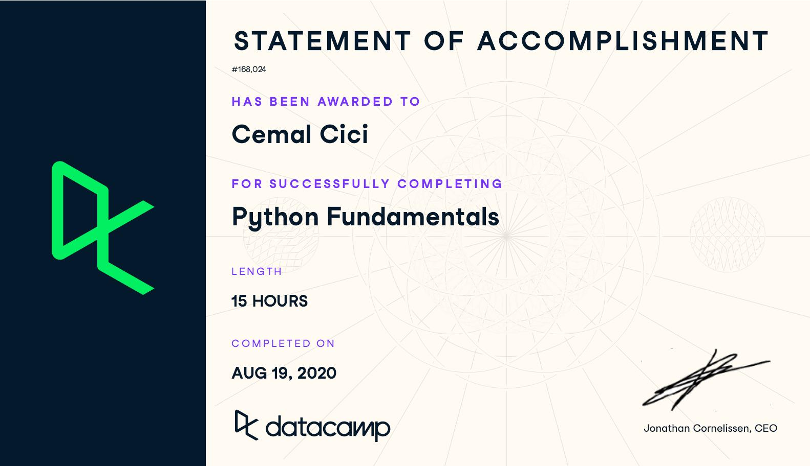

# 'Python Fundamentals Skill Track' Notlarım

[DataCamp][kurs-linki]'te bulunan `Python Fundamentals` beceri modüllerinde aldığım notları hazırladığım repo. Repoda mümkün olduğunca kodlar mevcut olup eğitim içeriğinin ilginizi çekmesi durumunda [buradan][kurs-linki] kayıt olabilir, takip edebilirsiniz.

- [x] [Python'a Giriş](https://github.com/cemalcici/datacamp-python-fundamentals-notes/tree/main/01-pythona-giris) (Introduction to Python)
- [x] [Orta Seviye Python](https://github.com/cemalcici/datacamp-python-fundamentals-notes/tree/main/02-orta-seviye-python) (Intermediate Python)
- [ ] Python Veri Bilimi Araçları - 1 (Python Data Science Toolbox - 1)
- [ ] Python Veri Bilimi Araçları - 2 (Python Data Science Toolbox - 2)

[kurs-linki]: https://www.datacamp.com/tracks/python-fundamentals